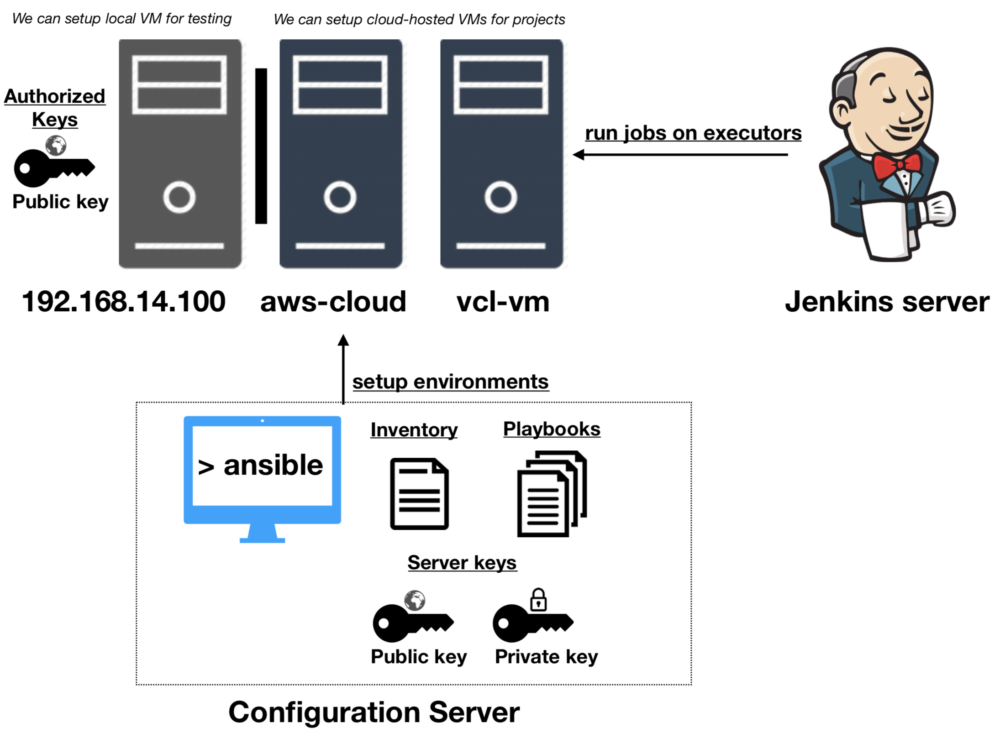

# Computing Environments Workshop --- Setting up a Jenkins executor

In this workshop, we will practice setting up a basic virtual environment and the following tasks:

* setting up ansible and virtual machines
* understanding ssh keys
* accessing a virtual machine through ssh
* running commands through ssh
* Using ansible to manage an inventory of servers and run commands over ssh 
* Practice installing `nginx` web server.
* Run ansible-playbooks for creating an executor for iTrust/jenkins.
* Verifying we can run build for iTrust!



## Pre-reqs

You can clone this repo to get useful files for this workshop: `git clone https://github.com/CSC-326/JenkinsExecutor` and then `cd JenkinsExecutor`.

### Ansible

Warning: Ansible does not run on Windows! You'll have to install in VM/docker container.

#### Mac/Linux

```
$ sudo easy_install pip # Can skip if already have pip
$ sudo pip install ansible
```

#### Create VM with Ansible w/Baker (Ubuntu 16.04)

Ensure you're running [latest Baker version (0.6.13)](https://docs.getbaker.io/installation/).
You may need to also [update VirtualBox](https://www.virtualbox.org/wiki/Downloads), especially if you've upgraded MacOS to Mojave.

In the current directory, you will find an virtual environment you can use to run ansible in a virtual machine:

```yaml
name: ansible-srv
vm:
  ip: 192.168.14.14
tools:
  - ansible
commands:
  roles: ansible-playbook roles.yml
  ping: ansible all -m ping -i inventory
  install: ansible-playbook main.yml -i inventory
  remote: ssh -i jenkins_rsa vagrant@192.168.14.100
```

In a terminal, the top-level directory with "baker.yml", run `baker bake`. You can access machine with `baker ssh`.

#### Create a VM for your executor

You can use the baker.yml in `JenkinsExecutor/executor_vm/` to create a target server where we will be performing our installations.


## Setting up ssh keys

You need a way to automatically connect to your server without having to manually authenicate each connection. Using a public/private key for ssh, you can ssh into your node VM from the Ansible Server automatically.

1. Verify you can ssh into your target machine (e.g. executor_vm). e.g., `cd executor_vm` and then `baker ssh`.

2. Create a new ssh-key, using ssh-key gen, but give the name, jenkins_rsa:

   ```bash
   ssh-keygen -t rsa -b 4096 -C "your_email@example.com"
   ```

3. You should have a public and private key that you can use for ssh connections. Let's copy the jenkins_rsa.pub into your clipboard (on mac `pbcopy < jenkins_rsa.pub` or `clip < jenkins_rsa.pub` in windows). 

4. Inside the target vm (you'll need to ssh), edit the `~/.ssh/authorized_keys` file by adding a new line containing your public key.

  Test your connection between ansible and node0:

```bash
       ssh -i jenkins_rsa vagrant@192.168.14.100
```

   If you see an error or prompt for a password, you have a problem with your key setup. 

## Ansible in action

Now that we have a ssh connection, we have one of the main tools for automation.

Notice, we can now start running basic commands on remote servers with just ssh:

```bash
ssh -i jenkins_rsa vagrant@192.168.14.100 ls /
```

However, we do not what to be stuck figuring out how to type complicated commands in shells and worrying about things like escaping strings, etc.

Instead, we can use tools like ansible, which use this ssh connection to run commands on a target machine for you.

#### Setting up inventory file and ssh keys

An inventory file allows ansible to define, group, and coordinate configuration management of multiple machines. At the most basic level, it basically lists the names of an asset and details about how to connect to it.

A `inventory` file typically contains something like the following.  **Note use your ip address and private_key**:

```ini    
[jenkins]
192.168.14.100 ansible_ssh_private_key_file=jenkins_rsa ansible_user=vagrant ansible_python_interpreter=python3
```

* Edit the inventory file to match your target vm.

From your local host (or machine running ansible), verify you can reach your inventory!

Now, run the ping test again to make sure you can actually talk to the node!

    ansible all -m ping -i inventory -vvvv


## Configuration management.

#### Simple installs

#### Performing configuration management
    
Let's install a web server, called nginx (say like engine-X), on the node. The web server will automatically start.

    ansible all -s -m apt -i inventory -a 'pkg=nginx state=installed'

Open a browser and enter in your node's ip address, e.g. http://192.168.14.100:80/

Removing nginx.

    ansible all -s -m apt -i inventory -a 'pkg=nginx state=removed'

Actually, nginx is a metapackage, show you also need to run this:

    ansible all -s -m shell -i inventory -a 'sudo apt-get -y autoremove'
    
Webserver should be dead!

#### Setting up the executor

* Running ping: `ansible all -m ping -i inventory`
* Setting up roles: `ansible-playbook roles.yml`
* Running install: `ansible-playbook main.yml -i inventory`
* Testing remote connection: `ssh -i jenkins_rsa vagrant@192.168.14.100`


#### Verifyfing setup.

Inside your target machine, you can now run:

```bash
git clone https://github.ncsu.edu/engr-csc326-staff/iTrust2-v3
```

Copy over the appropriate template files (in ~/settings), and then run 

* `mvn -f pom-data.xml process-test-classes` to generate database.
* `mvn clean test verify checkstyle:checkstyle` to run build.

You should be able to verify that you have built your environment successfull!


#### Problems

A bug in openJDK8 that just landed Oct 29, 2018, which may cause `mvn` to behave funky: https://bugs.debian.org/cgi-bin/bugreport.cgi?bug=911925

Updated pom.xml as work-around, by adding `<useSystemClassLoader>false</useSystemClassLoader>` to surefire and failsafe plugin configuration.

```xml
 <plugin>
    <groupId>org.apache.maven.plugins</groupId>
    <artifactId>maven-surefire-plugin</artifactId>
    <version>${surefire.version}</version>
    <configuration>
            <argLine>${surefireArgLine}</argLine>
            <skip>${skipSurefireTests}</skip>
            <useSystemClassLoader>false</useSystemClassLoader>
    </configuration>
</plugin>
<plugin>
    <groupId>org.apache.maven.plugins</groupId>
    <artifactId>maven-failsafe-plugin</artifactId>
    <version>${failsafe.version}</version>
    <configuration>
            <systemPropertyVariables>
                    <server.port>8080</server.port>
                    <cucumber.options>${cucumber.options}</cucumber.options>
            </systemPropertyVariables>
    <useSystemClassLoader>false</useSystemClassLoader>
    </configuration>

```